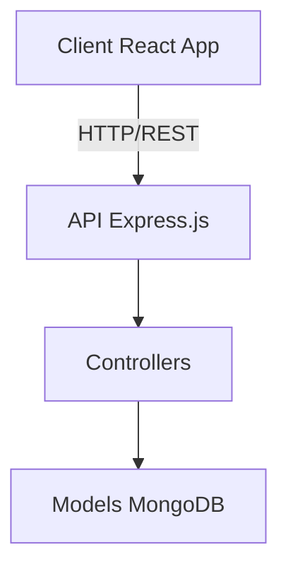

# 🚀 🔥 SMARTLENS PROJECT — COMPLETE OVERVIEW

## 📌 Definition
**SmartLens** is an AI-enabled, SaaS-based Photography Studio Management Platform. It empowers photography studios to:
- Manage their business online seamlessly.
- Handle customer portfolios and assets.
- Grow their revenue and track analytics.

---

## 🧠 SYSTEM TYPE
- ✔ **Multi-User System**
- ✔ **Multi-Tenant Architecture**
- ✔ **SaaS (Software as a Service)**
- ✔ **Subscription-Based Platform**

---

## 👥 USER ROLES
### 1️⃣ Studio (Normal User)
- Register / Login securely.
- Upload and manage photos.
- Access the Studio Dashboard.
- Upgrade subscriptions (Free to Premium).

### 2️⃣ Admin
- View and manage data across all studios.
- Track total revenue and conversion rates.
- Monitor advanced platform analytics.

---

## 🔐 AUTHENTICATION FLOW & SECURITY
### 📌 Step-by-step
1. User registers 👉 Password is securely hashed using **bcrypt**.
2. User logs in 👉 Server generates a **JWT (JSON Web Token)**.
3. Token is stored securely on the frontend.
4. Every protected request attaches the token to ensure identity.

**👉 Result: A secure, robust system ✔**

---

## 🏗️ SYSTEM ARCHITECTURE (MERN Stack)

### 📦 DATABASE MODELS
1. **Studio Model:** `name`, `email`, `password`, `phone`, `subscriptionPlan` (free/premium), `role` (user/admin).
2. **Photo Model:** `title`, `imageUrl`, `category`, `studio` (reference to Studio).
3. **Payment Model:** `studio`, `amount`, `status`, `transactionId`, `createdAt`.

---

## 🔥 CORE FEATURES
### 1️⃣ Authentication System
✔ Register & Login | ✔ JWT Token | ✔ Protected Routes

### 2️⃣ Role-Based Access
- `protect` middleware ensures login check.
- `isAdmin` middleware enforces admin-only access.

### 3️⃣ Multi-Tenant Data Isolation
- `studio: req.studio._id` ensures every studio strictly sees only their own uploaded data.

### 4️⃣ Photo Management System
✔ Upload photos | ✔ Fetch own photos | ✔ Categorization mapping

### 5️⃣ Subscription System
- **Free Plan:** Limited uploads.
- **Premium Plan:** Unlimited uploads and unrestricted access.

### 6️⃣ Payment System (Simulated)
✔ Payment API integration | ✔ Transaction ID generation | ✔ Automatic plan upgrade

### 7️⃣ Admin Dashboard (🔥 Powerful Analytics)
**Metrics Tracked:**
✔ Total Studios | ✔ Total Photos | ✔ Premium vs Free Studios | ✔ Total Revenue | ✔ Conversion Rate | ✔ Monthly Revenue | ✔ Growth Rate | ✔ Most Active Studio

---

## 📊 ANALYTICS ALGORITHMS EXPLAINED
- **💰 Revenue:** Sum of all successful mock payments.
- **📈 Conversion Rate:** `(Premium / Total Studios) * 100`
- **📊 Monthly Revenue:** Current month income relative to last month.
- **🚀 Growth Rate:** `((ThisMonth - LastMonth) / LastMonth) * 100`
- **👑 Most Active Studio:** Aggregation grouping by studio, counting photos, sorting descending, and picking the top contributor.

---

## 🌐 FRONTEND WORKFLOW
1. **Login Page:** Email/password input ➔ API call ➔ Token stored securely.
2. **Protected Routing:** Without token ➔ Redirect to login. With token ➔ Access dashboard.
3. **Admin UI:** Dynamic display of Revenue, Stats, Growth, and Engagement.

---

## 🔄 COMPLETE USER FLOW
- **🎯 Studio User Flow:** Register ➔ Login ➔ Upload photos ➔ Hit limit ➔ Upgrade plan ➔ Continue usage.
- **🎯 Admin Flow:** Login (admin role) ➔ Access dashboard ➔ View analytics ➔ Track revenue ➔ Monitor studios.

---

## 🧠 SYSTEM LEVEL UNDERSTANDING
- **🔐 Security:** Password hashing, JWT authentication, and protected APIs.
- **⚡ Performance:** Aggregation queries, efficient filtering, indexed MongoDB fields.
- **🧩 Scalability:** Multi-user ready, SaaS architecture capable of handling thousands of interconnected studios.

---

## 🚀 REAL WORLD USE CASE
This system is ready to be deployed and used for:
- Photography Studios
- Event Agencies
- Freelancers
- Digital Portfolio Platforms

---

## 💎 INTERVIEW SUMMARY

> "I built a full-stack multi-tenant SaaS platform using the MERN stack that supports authentication, role-based access, subscription monetization, payment simulation, and advanced admin analytics like revenue tracking, conversion rates, and growth metrics."

